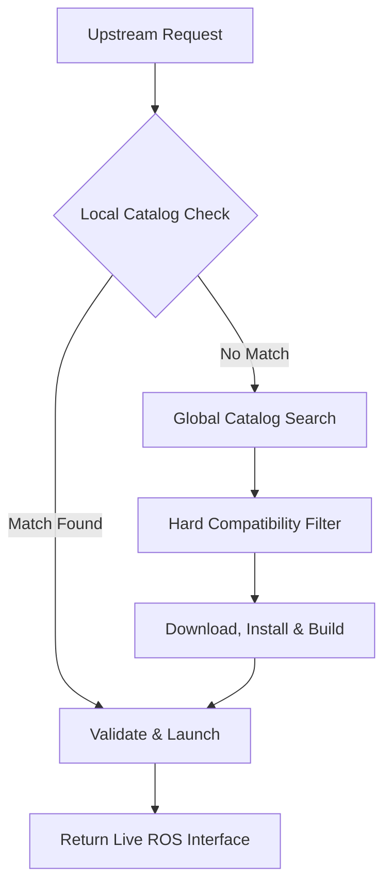

# skill_acq

`skill_acq` is a ROS 2 package for **runtime skill acquisition**.

When an upstream planner, agent, or executive layer determines that the robot needs a capability that is not available in the active ROS graph, `skill_acq` checks whether a compatible implementation already exists locally. If not, it retrieves one from a curated global catalog, installs it, validates that the promised ROS interface is live, and makes it available for execution. Successfully acquired skills are written back into the local catalog so future requests can resolve locally.

The goal is simple: **turn a missing capability into a runnable ROS action at runtime**.

---

## Current Status (V0 Prototype) & Roadmap

This repository currently reflects the **V0 prototype**, with foundational architecture developed to address dynamic skill loading. We are actively migrating the core acquisition loop toward the formal V1 capability contract model described below.

* **Immediate Testing:** The `reverse_string_action` package serves as the minimal reproducible baseline for the fetch-build-validate pipeline.

The reverse-string demo can run without an API key by using deterministic catalog selection. A local catalog database does not need to be checked into the repository; if `package_catalog.db` is missing, `skill_acq` creates an empty local catalog and then falls back to the global catalog.

First, build and source this package from the root of your ROS 2 workspace:

```bash
source /opt/ros/$ROS_DISTRO/setup.bash
colcon build --packages-select skill_acq
source install/setup.bash
```

In one terminal, source ROS 2 and watch the output topic:

```bash
cd ~/ros2_ws
source install/setup.bash
ros2 topic echo /rev_string std_msgs/msg/String
```

In another terminal, run acquisition and execution:

```bash
cd ~/ros2_ws
source install/setup.bash

ros2 run skill_acq skill_acq.py \
  'reverse the string "hello"' \
  --set input_string=hello \
  --set publish_topic=/rev_string \
  --selection-backend catalog
```

On the first run, `skill_acq` resolves the request through the global catalog, downloads/builds the selected reverse-string package in the runner workspace, executes it, and writes the acquired skill back into the local catalog. Later runs can resolve from the local catalog.

* **Hardware Validation:** The dynamic acquisition and execution pipeline has been successfully tested on Innate's MARS platform using the `come_to_user` capability. [Watch the MARS platform demonstration on YouTube here](https://www.youtube.com/watch?v=NsvAFBiPR-U).

Please refer to the GitHub Issues tracker for current milestones regarding the V1 release, including structured platform variants and automated capability resolution.

---

## Installation and Quickstart

Ensure you have a standard ROS 2 workspace (e.g., Ubuntu 22.04 with ROS 2 Humble or Jazzy) and clone the repository.

```bash
mkdir -p ~/ros2_ws/src
cd ~/ros2_ws/src
git clone [https://github.com/raoanjali/skill_acq.git](https://github.com/raoanjali/skill_acq.git)
cd ~/ros2_ws
colcon build --packages-select skill_acq
source install/setup.bash
```

---

## What this package is and is not

`skill_acq` is a **capability-resolution and acquisition layer**. It runs only after some other part of the system has already decided what capability is needed.

It is **not**:
- a task planner
- a task decomposition framework
- a general robot executive
- an unrestricted package search engine
- a code-generation system

In short:
- **upstream modules** decide what the robot should do next
- **`skill_acq`** decides how to make the required capability runnable on this robot

---

## Architecture

`skill_acq` sits between **missing-capability detection** and **runtime execution**.

Its boundary is the same across autonomy stacks:

> a required capability has already been identified, but there is no compatible live provider for it on the robot right now

That is when `skill_acq` begins.

### Integration patterns

#### 1. Planner-driven stack
A symbolic planner or executor calls `skill_acq` when execution reaches an action with no compatible implementation.

#### 2. Agent-driven stack
An LLM agent exposes `skill_acq` as a tool such as `resolve_capability(...)`. If current tools are insufficient, the agent invokes that tool to acquire the missing capability.

#### 3. Executive-layer stack
An executive layer exposes `skill_acq` as an affordance or tool adapter such as `acquire_capability(...)`. If the current affordance set is insufficient, it invokes `skill_acq`, refreshes its capability view, and continues execution.

### Why the boundary is the same

The upstream framework may differ, but the handoff condition does not. Upstream components answer:

**“What capability is needed next?”**

`skill_acq` answers:

**“How do I make that capability runnable on this robot?”**

The reply from `skill_acq` is `True` (if a skill was found and its installation was successfully validated) or `False` (if no matching skill was found or installation failed).

### Architecture diagram & Core acquisition flow



1. An upstream module requests a capability and provides `platform_name`.
2. `skill_acq` checks the local catalog first.
3. Candidates are filtered using hard compatibility constraints.
4. If no compatible local skill exists, `skill_acq` searches the curated global catalog.
5. If a global skill is selected, `skill_acq` can require explicit approval before installation.
6. The selected skill is downloaded into a runner workspace.
7. Dependencies are installed and the package is built if needed.
8. The system validates that the promised ROS interface actually comes online.
9. The newly acquired skill is added to the local catalog.
10. A runnable capability is returned to the caller.

### Installation confirmation
Compatible local skills can be used directly. If no compatible local skill exists and global acquisition is required, `skill_acq` can require explicit confirmation before download and install. A confirmation prompt should show:
- selected `skill_id`
- source repository or artifact
- pinned commit hash or immutable version
- declared `platform_name`
- exposed ROS interface

*Automated workflows can bypass this explicitly, for example through an auto-approve flag or parameter.*

---

## Capability Discovery

`skill_acq` uses a local-first discovery model.

### Local discovery
The first step is always to check the local capability catalog for installed skills already available on the robot. This avoids unnecessary downloads and lets the robot’s capability surface grow persistently over time.

### Global discovery
If no compatible local match exists, `skill_acq` searches a curated global catalog of approved skills. This catalog is not a raw index of arbitrary repositories; it is a reviewed registry of skills that include the metadata required for compatibility checking and runtime bringup.

### Discovery mechanics
Discovery is not purely semantic. A package that sounds correct in natural language is not useful if it cannot run on the target robot. Discovery is therefore split into:
1. **Hard filtering:** Ensuring platform and ROS distribution match.
2. **Semantic selection among compatible candidates:** Once candidates successfully pass the hard compatibility filter, the discovery mechanism **iterates through all exposed actions for all nodes** listed within those candidate packages to find the optimal semantic match against the original request.

---

## Capability Contracts

Every skill must declare a machine-readable capability contract.

In v1, compatibility is expressed primarily through a single `platform_name`. This keeps the interface simple and makes it easy for upstream modules to call `skill_acq` without providing full embodiment metadata. Support for platform variants, structured robot profiles, and richer hardware constraints is planned for a future version.

### Hardware-Agnostic Skills
For software-only skills that do not rely on specific kinematics or sensors (e.g., pure software data manipulation or generic math nodes), the contract must explicitly declare hardware independence using a wildcard. Do not leave the field blank.
* Specify `"platform_name": ["all"]` to bypass hardware restrictions.

### Required contract fields for v1
At minimum, a skill should declare:
- `skill_id`
- `platform_name`
- `ros_distro`
- `aliases`
- `keywords`
- `description`
- the ROS interface it exposes (`interfaces_exposed`)
- the launch target
- the validation method

### Why the contract matters
The contract does more than describe the skill. It lets `skill_acq` filter out incompatible candidates before semantic or lexical selection, and it declares which ROS interface is expected to come online after launch.

### Example capability contract
```json
{
  "skill_id": "come_to_user",
  "platform_name": ["mars", "turtlebot3"],
  "ros_distro": ["humble", "jazzy"],
  "aliases": [
    "approach user",
    "go to user",
    "move to person"
  ],
  "keywords": [
    "navigation",
    "person"
  ],
  "description": "Navigate toward the user until within handoff distance.",
  "interfaces_exposed": {
    "actions": ["/come_to_user"]
  },
  "launch_target": "come_to_user.launch.py",
  "validation": {
    "type": "action_server_available",
    "name": "/come_to_user"
  }
}
```

---

## Skill Acquisition: Download, Install, Validation

Once a compatible skill has been selected, `skill_acq` turns it into a runnable capability through a manifest-driven pipeline.

### Acquisition steps
1. Select a compatible local or global skill
2. Stage the package into the runner workspace
3. Install dependencies
4. Build the package if needed
5. Launch the declared target
6. Validate that the promised ROS interface is live
7. Return a runnable provider to the caller

### Why validation matters
Installation alone is not enough. A skill is useful only if the system can verify that the promised interface is actually available after launch. Examples of validation:
- action server appears
- service becomes available
- required node is running
- expected topic is live

If validation fails, the skill must not be treated as available.

### Interface binding
Each skill contract declares the ROS interface it is expected to bring online, such as an action name or service name. During acquisition, `skill_acq` installs and launches the selected package, validates that the declared interface is live, and returns that runnable interface to the caller.

---

## Deterministic Fallback Selection

`skill_acq` does not require a cloud model to function. When no LLM provider is configured, `skill_acq` falls back to deterministic selection after hard compatibility filtering.

### Metadata used for deterministic selection
The fallback relies on semantic metadata:
- `skill_id`
- `aliases`
- `keywords`
- `description`

*(Note: The `interfaces_exposed` and `validation` fields are used strictly for post-launch health checks, not for resolving the initial semantic request).*

### Selection behavior
Deterministic selection prefers:
1. exact `skill_id` match
2. exact alias match
3. exact normalized title or capability match
4. lexical overlap over aliases, keywords, and description
5. local installed skills over global candidates
6. previously validated skills over never-run candidates

### Safe failure behavior
If no candidate passes a minimum threshold, or if multiple candidates remain too close to distinguish safely, then `skill_acq` returns an explicit:
- `no_match`, or
- `ambiguous_match`

instead of guessing. If `no_match` is found, a `False` failure flag is returned to the upstream component that called `skill_acq`. This keeps selection conservative and auditable.

---

## Optional LLM Configuration

`skill_acq` can use an LLM provider for semantic ranking after hard compatibility filtering. This is optional. If no API key is configured, `skill_acq` still works using deterministic matching over compatible candidates.

### How configuration works
The API key is read by `skill_acq` itself at startup. Downloaded skill packages do not request, store, or manage model API keys. Set the provider and key in the environment before launching `skill_acq`.

**OpenAI**
```bash
export SKILL_ACQ_LLM_PROVIDER=openai
export OPENAI_API_KEY="your_key_here"
```

**Gemini**
```bash
export SKILL_ACQ_LLM_PROVIDER=gemini
export GEMINI_API_KEY="your_key_here"
```

### Behavior when no key is set
If no supported API key is found, `skill_acq` skips semantic ranking and falls back to hard filtering plus deterministic selection. This keeps runtime skill acquisition usable in offline, restricted, or non-cloud deployments.

---

## Updating the Global Skill Catalog

The global skill catalog is intentionally curated. `skill_acq` does not install packages directly from arbitrary repositories at runtime. Instead, developers submit skill repositories for review, and only approved entries are added to the catalog.

### Submission flow
1. A developer submits a repository or release for review.
2. An automated script checks that required metadata is present.
3. The maintainer reviews the package manually.
4. If approved, the package is added to the catalog as a version-pinned entry.

### Why pinning matters
Approved catalog entries must point to a specific immutable version, such as a commit hash which has been verified by the maintainer. The system should never install from a moving branch such as `main`.

### What the automated check should verify
At minimum, a submitted skill should include:
- a machine-readable capability contract
- supported `platform_name`
- ROS compatibility information
- launch target
- validation instructions
- repository URL
- pinned commit or artifact reference
- license

### What the manual review is for
Manual review is the trust mechanism in v1. It helps answer questions like:
- does the package appear to do what it claims?
- are the declared requirements reasonable?
- is the launch and validation path reproducible?
- is this appropriate to distribute through the catalog?

### Example catalog entry
```json
{
  "skill_id": "come_to_user",
  "repo_url": "[https://github.com/example/come_to_user](https://github.com/example/come_to_user)",
  "git_commit": "0123456789abcdef0123456789abcdef01234567",
  "platform_name": ["mars", "turtlebot3"],
  "ros_distro": ["humble", "jazzy"],
  "launch_target": "come_to_user.launch.py",
  "validation": {
    "type": "action_server_available",
    "name": "/come_to_user"
  }
}
```

---

## Why this matters for ROS 2 developers

ROS 2 already has modular software, packages, and reusable stacks. The missing systems problem is not whether robot software can be modular; it is whether a robot can detect that it is missing a capability, find a compatible implementation, and bring it online as part of a running system.

That is the gap `skill_acq` is intended to address. This matters because it enables a different way to think about robot capability development:
- a robot does not need every behavior preinstalled
- capabilities can be added when needed
- compatibility can be enforced before selection
- successful acquisitions persist into future requests
- a curated ecosystem of third-party skills becomes possible

For ROS 2 developers, this means a skill can be packaged not just as source code, but as a discoverable, installable, and runnable capability.

---

## Repository structure

```text
skill_acq/
├── scripts/
│   ├── skill_acq.py               # Main request entry point
│   ├── select_ros_target.py       # Candidate resolution post-filtering
│   ├── run_ros_target.py          # Staging, building, and validation logic
│   ├── build_package_catalog.py   # Local database rebuild utility
│   └── package_catalog.py         # Shared SQLite handlers and compatibility logic
├── package_catalog.db             # Local persistent capability registry
└── global_package_catalog.json    # Curated registry of approved global skills
```

---

## Example usage

`skill_acq` should be called by a BT node or within a tool call in a framework like ROSA.

```bash
ros2 run skill_acq skill_acq.py "come to the user" --platform-name mars --ros-version jazzy 
```

### Action Remapping
Optionally, the upstream process can dynamically overwrite the expected ROS action namespace during bringup to suit complex fleet routing.

```bash
ros2 run skill_acq skill_acq.py "come to the user" --platform-name mars --ros-version jazzy --remap-action /come_to_user:=/custom_namespace/come_to_user
```

---

## Sample skills

Two simple examples illustrate the architecture.

### 1. `reverse_string_action`
A deliberately simple skill used to prove the acquisition loop itself. On the first request, the skill is acquired globally. On later requests, it is resolved locally.

### 2. `come_to_user`
A more embodied example where the system acquires a robot-facing skill, installs it, validates the ROS interface, and then executes the behavior on a robot.

Together these show:
- persistent acquisition in a controlled setting
- acquisition resulting in a live robot capability

---

## Roadmap / future work

The current prototype focuses on a practical v1 architecture:
- local-first capability resolution
- hard compatibility filtering
- curated global acquisition
- pinned versions
- manifest-driven installation
- runtime validation

Planned next steps include:
- richer capability contracts with structured platform variants beyond a single `platform_name`
- stronger platform profiling and automatic profile resolution
- immutable skill artifact hosting beyond source repositories
- more automated global catalog submission and review workflows
- improved runtime lifecycle management, health monitoring, and rollback behavior

---

## Contributions

Contributions are welcome. Good contributions include:
- new skill packages with clear capability contracts
- improvements to compatibility checking
- stronger validation and readiness detection
- safer catalog tooling
- better runner isolation and failure handling
- additional demo skills for new robot platforms

### Submitting a skill to the global catalog
For now, global catalog inclusion is manual. To submit a skill:
1. send the repository URL and pinned commit hash to the maintainer
2. make sure the repository includes the required manifest and compatibility metadata
3. include clear launch and validation instructions
4. include the supported `platform_name` values and ROS distribution

**Maintainer contact:** `10.anjalirao@gmail.com`

---

## License

This project is licensed under the MIT License. See the `LICENSE` file for details.
